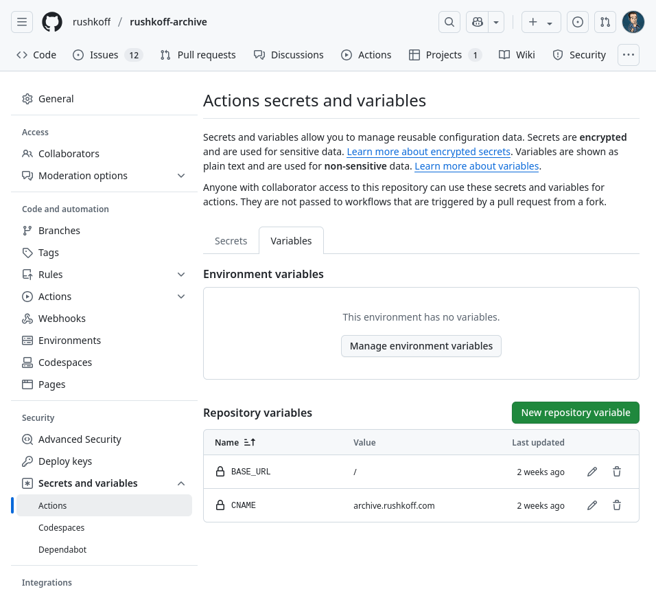

# TinaCMS 

TinaCMS is a service which provides a user interface ("UI") for various sorts of "static site generator", like Hugo, Gatsby, AstroJS, and of course, Jekyll. We use Jekyll.

Jekyll works independently of TinaCMS, in that it knows nothing about it. TinaCMS knows about the format and structure of the content Jekyll uses, stored in a Git repository on GitHub, and provides a window in a UI on their website. When you edit the content in TinaCMS, it commits the changes into the repository, which then triggers Jekyll to rebuild pretty much as before. (Although there is an extra step in the build now, in which TinaCMS's database is updated.)

## Defining the terms

The parts you need to understand a bit about to follow this are:

- *http://tina.io*: the website where the Tina service is hosted.
- *TinaCMS*: the software which implements this service.
- *Markdown*: a scheme for writing formatted text, simpler and more readable than HTML.
- *Front matter*: a scheme for adding meta-data tags at the head of a
  markdown file, providing information about that file (e.g. title,
  author, dates of publishing, modification, links to banner images, etc.)
- *Git*: a popular open-source version-control system, for tracking and managing collections of text.
- *Jekyll*: the software which converts the raw website content in plain text files 
- *GitHub*: a company providing an online project management service which builds on Git
- *GitHub Pages*: a facility for publishing web pages provided by GitHub

To tie it together:

- The Rushkoff Archive is built using Jekyll, in the `/src/` directory.
- The content is in Markdown files, with front-matter. They have the
  `.md` suffix. This is a common format for static site generators.
- These files are organised in "collections", which are essentially
  folders containing articles of a particular sort - with a uniform
  set of front-matter tags. e.g Articles, Publications, and
  Categories, (stored in the folders `_articles/`, `_publications/`,
  and `_categories/`).
- Jekyll combines this content with some templates files containing
  HTML, images and CSS, to create files for a static website which can
  be published online.
- This is all stored in a Git repository in a GitHub project. This is the "source of truth".
- Any changes to that repository on GitHub trigger a "GitHub Action" which is a job that:
  - Runs TinaCMS to insert the TinaCMS "admin" user interface page
    into the site content, under `/src/admin/`.
  - Synchronises the site content with `tina.io` (search and meta-data).
  - Runs Jekyll to rebuild the website, along with the admin UI.
  - Publishes the website via GitHub pages.
- Changes to the content can be made by vising the admin UI under the
  path `/admin/` on the published website. This alters the repository,
  triggering a rebuild.

## Authenticating

TinaCMS's website service has "Organisations" which contain
"Projects", and can be accessed by users, who cab be "Editors" or
"Admins". 

See https://tina.io/docs/product-tour

The Rushkoff Archive is edited via a project within "Douglas
Rushkoff's Organization" on https://app.tina.io

On the "free tier" of TinaCMS, there is a limit of two users who be
"collaborators" in the organisation.

### First time

Visit https://app.tina.io, and create an account, if you don't have
one already.

You then need to be added to "Douglas Rushkoff's Organization". You
can do this by sending the email you use for your log-in name for
tina.io to a maintainer of that organisation and requesting access,
either directly via email, or via an issue on GitHub. They can then
give you access as a "collaborator", which allows you to edit
content. If you are marked an admin, you can also configure the Tina
Cloud dashboard's settings.

Then make sure it works well enough for you. For instance, you should be able to:

- add an article.
- alter an article.
- upload / select media for articles.

See below for more information.

### Subsequently

Log in to https://app.tina.io and select "rushkoff-archive". This is
the "Tina Cloud" dashboard for the website, and is where the basics are
configured. There is documentation for that here:

https://tina.io/docs/tina-cloud/dashboard

Briefly, you should see a link to "View Site", or "Edit Site" on the
landing page of the dashboard.

The former just takes you to the published site at http://archive.rushkoff.com.

The latter takes you to the path http://archive.rushkoff.com/admin/
below the published site's landing page. This is where the user
interface for editing content is published.

You can of course just bookmark this page and go there directly.

## Next steps for editors

Having read this article, TinaCMS's own documentation is probably the
best place to go for help initially:

https://tina.io/docs

In particular, the [Introduction](https://tina.io/docs/product-tour)
and instructions for [Using the TinaEditor](https://tina.io/docs/using-tina-editor).

This will explain the main editing UI.

It also links to other places you can get help.

### Rushkoff Archive specifics.

The structure is dictated by the Jekyll configuration in `/src/`. See
Jekyll's documentation for that. We shan't go into the details here.

The main thing to note is the concept of "collections", mentioned
above. These are listed in the editor UI's sidebar. Clicking on one
allows you to add, delete, and edit documents in that
collection. 

There are:

- Articles - these are listed on the landing page.
- Publications - these represent the publications that articles appeared in.
- Categories - these represent the categories articles can belong to.
- Videos - not currently used, were for embedding video content elsewhere.
- Misc - not currently used, were for embedding or linking to non-video content elsewhere.

The latter two are not shown on the published website.

Publications can be freely modified - if you add a new item, there'll
be a new publication in the site's list. Articles must have a
publication associated. Currently, one each. You can change titles,
but don't delete publications if any articles are using them!

The site landing page links to a list of all publications, which link
to pages for the publication listing the articles associated with it.

Categories are similar to Publications, except that articles can have
zero or more associated. However, although this works in the world of
Jekyll, TinaCMS does not support this very well, and an experiment
showed how clumsy the result was. Therefore: the TinaCMS UI shows a
fixed list of checkboxes to mark and article's category
memberships. Don't add new Categories, or delete them, without
technical consultation. If the Category list changes, this won't,
unless manually edited (the configuration is in `/src/tina/config.ts`,
and requires a bit of technical know-how to alter.)

The site landing page lists the categories, which link to a list of
articles in the category.

## Administrating Tina Cloud

To understand more about this, you might start at [Going to
Production](https://tina.io/docs/tina-cloud) for technical details on
how Tina Cloud works.

At the time of writing, my overall impression of TinaCMS is that it's
rather fragile and has a few bugs remaining. The configuration file
`src/tina/config.ts` has various API keys, tokens, paths and other
settings which have to be just right, otherwise things break.

### Deploying

One aspect which won't be covered in the TinaCMS documentation are the
particulars of deploying this website. This section assumes a
technical audience.

It is possible to check this code out on your laptop, and build the
site there. In fact this is typically how I develop the site.  You'll
need familiarity with Ruby, for the Jekyll side, and Typescript (or at
least Javascript) for the TinaCMS side.

The orgaisation of the repository isn't a typical Jekyll or TinaCMS
one, as the Jekyll site is under `/src/`. You should run all Jekyll
and TinaCMS CLI commands from there.

For instance

    bundle install              # install Jekyll's dependencies
    bundle exec jekyll serve    # build & publish the site on a local http server
    bundle exec jekyll build    # just build the site
    
    npm install                 # install Tina's dependencies
    npm run serve               # build & publish the site on a local http server

The TinaCMS parts are mostly within `/src/tina/` - there is a config
file there which needs to know:
- where in the repository it is,
- where certain files and assets are relative to it
- what the fields of the Jekyll collections are
- and importantly, a bunch of tokens and API keys by which to access the tina.io services.

For full details, I refer you to the file itself and the [TinaCMS documentation](https://tina.io/docs/schema) for it.

Another thing to note is the file `/src/tina/tina-lock.json` - this is
regenerated by running the `npm run tinacms dev` or `npm run serve`
commands in `/src/`. It then needs to be committed and pushed up to
GitHub for the rest of the TinaCMS machinery to work.

Beyond that, this site designed to work on GitHub, using "GitHub
Actions" to build and publish the generated HTML on "GitHub Pages".

What those actions do is defined by the configuration file `.github/workflows/main.yml`. Inspect that and the [documentation at GitHub](https://docs.github.com/en/actions/writing-workflows/quickstart) to understand more about it. But in brief:

- Create an installation of Ubuntu Linux in GitHub's cloud
- Install the prerequisites and check out this repository
- Rebuild TinaCMS with `npm run tinacms build`
- Rebuild Jekyll with `bundle exec jekyll build` (with the correct base-dir setting)
- Publish the output via Github pages, which is configured with the archive.rushkoff.com domain.

GitHub should spot the workflow file and act accordingly, whenever changes are made to the master branch.

But there are some extra steps you need to do to set up a github pages publication, and provide the sensitive information - API keys and application tokens - that you will find on the Tina Cloud dashboard for Rushkoff-Archive project there.

The following should be configured in the GitHub settings pages for the `rushkoff-archive` project:

### Settings -> Pages

Set things as in the screenshot below.
- Source: deploy from a branch
- Branch: `gh-pages` path `/` (root)
- Custom domain: archive.rushkoff.com
- Enforce HTTPS (if enabled)

### Settings -> Secrets and variables -> Actions

Set things as in the screenshot below, for the "secrets" tab:
- TINA_PUBLIC_CLIENT_ID - this is the "Client ID" from the Tina Cloud Dashboard for the project.
- TINA_SEARCH_TOKEN - this is the "Search" token from the "Tokens" tab of the dashboard
- TINA_TOKEN - this is the "Content (Readonly)" token from the same tab

And as below for the "variables" tab:
- CNAME: `archive.rushkoff.com` (this is the site's published domain)
- BASE_URL_PATH: `/` (this is the site's path on the published domain)

## Questions and answers

These are questions which have been asked, with answers to them.

### How do I add articles?

> I added an article to Tina. How do I re-publish the website to make that article part of GitHub?

The process to add an article is:

- Go here https://archive.rushkoff.com/admin/#/collections/articles/~
- Click "add files" to create a new article
- Fill out the fields. Use today's date in the date field.
- The save button is greyed out until you fill in all the required fields.
- Hit "save" when it's complete.
  - The result will be committed to GitHub as soon as you hit "save".
  - Any changes to the content of the master branch on GitHub trigger a redeploy.
  - It's slow, taking two or three minutes to crank it out, because the whole site is rebuilt.
  - Check the build progress here: https://github.com/rushkoff/rushkoff-archive/actions
  - Jobs will have a yellow dot if they're active, a green dot when complete. They will be labelled:
    - "TinaCMS content update"
    - "pages build and deployment"
- When the build and redeploy jobs have finished, you should see the new article at the top of the front page of the site. They are sorted by publication date.

In addition, you can check for evidence of changes to the site in the commit history here:

  https://github.com/rushkoff/rushkoff-archive/commits/master/

Every one of these commits will trigger a rebuild. It's possible to have several rebuilds triggered, in which case only the last one matters - the others can safely fail, as they sometimes do.

### How do I format the article text in the main text entry box? Italics, linked words, etc.

There's a toolbar above the "Body of Document" text area, as in the image below. Is that visible to you? That has buttons for link, images, block quote, bullets, numbered lists, bold, strike-through, italics, etc.

It starts in "rich text" mode with that toolbar, but you can switch it to "markdown mode" via the button with an "M", and the toolbar is absent in that mode.

### Can I embed video code into articles? 

Currently, no. You can do it in principle using Jekyll, but the TinaCMS UI doesn't support this as far as I know.

Note, don't confuse the code block in the editor toolbar for this: they are essentially like surrounding test with `<pre>` tags, and are for rendering source code and suchlike. Not for executing it!

Markdown by design *can* include HTML tags, but typically the permitted tags are limited downstream of the editor, so that this feature can't be abused. Any `<iframe>` tags won't make it though unless they're explicitly allowed.

The "Videos" collection on the archive was meant to allow linking to external video content, but we disabled it. An extension to Jekyll was also added to allow embedded videos in any block of markdown, but use of that doesn't seem to be permitted by TinaCMS's UI.

### How do I add publications?

> When I want to add a publication, I simply add it from the Publications page, but then leave everything blank except the name? 

Yes, this works.

Adding new Publications is like adding new Articles, but there are fewer fields.

The "Body" text field for Publications, if there is any, will appear on the page for that publication, below the title, above the list of articles. For instance:

  https://archive.rushkoff.com/publications/adbusters.html

It's up to you if you do that or not - it's fine to leave it empty.

### How do I add categories?

> I probably don't have the ability to add a category, right? Or can I use that, too?

You do in principle, but in practice, don't. (See comments above.)

On the level of Jekyll, the site allows you to add new categories, as you can for publications.

However, TinaCMS has a technical limitation which means it doesn't support that - except in such an awkward way which seems hard to use. Instead I just used a hard-wired list of categories, which is more usable in the UI: it appears as some check-boxes.

We can still change the categories, but it's not as simple as adding publications, because also takes some reconfiguration of TinaCMS.

### I created an article but it's not on the site. Where has my article gone?

It can be a bit confusing, I agree, because the filenames and the article names aren't always consistent. 

(This has been improved a bit since the question was asked.)

- Make sure all the build jobs have finished (see above).
- Make sure to distinguish between articles with similar titles and filenames.
- Note that the landing page sorts by publication date, so if these are different, they may not appear next to each other there.
- Note that in the TinaCMS editor, Articles sort by title, so recent articles may not be near the top.
- Use the search to find the articles, either on the published site, or in the TinaCMS UI. 
  - Although the search function in the TinaCMS UI doesn't always work as expected.
  - The "sort by date" doesn't seem to.
  - Text search looks in titles and the article body, not the filenames.
  - But punctuation and space isn't handled very well.

For instance, there can be articles with the same title, but different filenames and dates:

 - "Article One", 4th Feb 2025: https://archive.rushkoff.com/articles/article.html
 - "Article One", 3rd Mar 2025: https://archive.rushkoff.com/articles/articel.html

I recommend:
- Keeping the titles and the filenames equivalent. Be consistent with the filenames: use-lower-case-hyphenated instead of StudlyCaps. *(This should now be automatic.)*
- Setting the date of the article carefully *(The current date should now be the default)*
